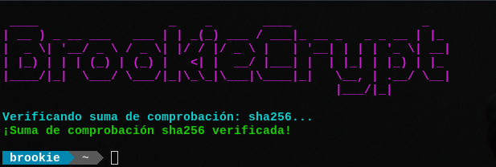
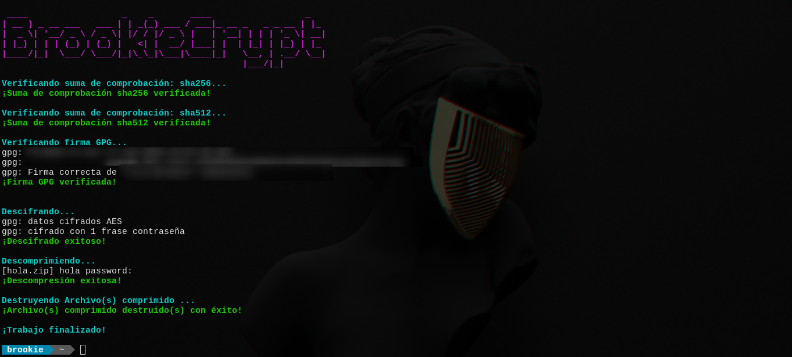

**BrookieCrypt es un programa que sirve para comprimir, cifrar y crear sumas de comprobación
de un archivo o una carpeta, todo esto en conjunto.**

**Básicamente lo que hace BrookieCrypt es tomar el archivo o directorio que le indique, lo
comprime con el algoritmo "zip" y lo "protege" con la contraseña que usted le indique.
Luego, cifra el archivo comprimido con cifrado simétrico, utilizando el programa GnuPG (GPG)
que, se supone, debe tener instalado a "priori". Así, se le suma "una capa de protección más"
al archivo. Después de haber conseguido eso (si sucede algún error en el proceso BrookieCrypt le avisará)
crea tres archivos, correspondientes a sumas de comprobación: sha256 y sha512 y la firma GPG.
Por último "destruye" el archivo comprimido que inicialmente creó para antes del cifrado y, si así lo desea
también "destruye" el archivo que comprimió y cifró.**

**Algoritmo(s) de compresión utilizado(s):**
```
zip
```

**Método de cifrado:**
```
Simétrico
```

**Dependencias:**
```
zip
GnuPG (GPG)
GNU Core Utils
```

**Opciones disponibles:**
```
-a      Verifica una firma hash sha256. Ej: -a <archivo_con_firma> -f <archivo_firmado>
-b      Verifica una firma hash sha512. Ej: -b <archivo_con_firma> -f <archivo_firmado>
-c      Cifra un archivo o directorio.
-d      Descifra un archivo.
-f      Especifica el archivo o directorio a cifrar, descifrar o verificar firma hash.
-g      Verifica una firma GPG. Ej: -g <archivo_con_firma> -f <archivo_firmado>
-h      Muestra esta página de ayuda y sale.
-i      Muestra información sobre el programa y sale.
-v      Muestra información sobre cada paso que realiza.
-y      Asume que está de acuerdo con la eliminación del archivo fuente
        de cifrado o archivo comprimido (Dependiendo del caso).
```

**Ejemplos de uso:**





**Cómo instalar dependencias:**

**Debian (y derivadas):**
```
$ sudo apt update
$ sudo apt install coreutils zip gpg
```

**Fedora (y similares):**
```
$ sudo dnf update
$ sudo dnf install coreutils zip gpg
```

**Arch Linux (y derivadas):**
```
$ sudo pacman -Syy
$ sudo pacman -S coreutils zip gpg
```

**Gentoo (y derivadas):**
```
$ sudo emerge --ask coreutils zip gpg
```
